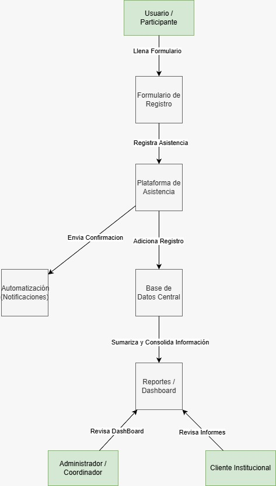

# PRACloud – Plataforma de Registro y Asistencia Cloud

## Descripción general
PRACloud es un proyecto académico de Investigación y Desarrollo (I+D) orientado al diseño e implementación de una plataforma ligera de registro y control de asistencia basada en la nube (**Cloud Attendance Lite**).

La solución busca sustituir el uso de hojas de cálculo dispersas por un sistema centralizado, automatizado y trazable, que permita gestionar eventos académicos, participantes y asistencias, así como generar reportes básicos de participación.

Este proyecto se desarrolla como parte de una estancia académica bajo un enfoque SaaS académico, utilizando servicios cloud de bajo costo o *free tier* y datos simulados.

---

## Objetivos del proyecto

### Objetivo general
Analizar, diseñar, implementar y documentar una plataforma web/cloud para el registro y control de asistencia a eventos académicos, incorporando automatización y generación de reportes básicos.

### Objetivos específicos
* Diseñar un modelo de datos para eventos, sesiones, participantes y asistencias.
* Implementar un formulario cloud para el registro de asistencia.
* Centralizar los datos en una base de datos en la nube.
* Automatizar validaciones, confirmaciones y generación de métricas.
* Diseñar un dashboard para visualización de asistencia.
* Documentar la arquitectura, procesos y uso de la plataforma.

---

## Tecnologías utilizadas
* **Plataforma Cloud:** Google Workspace
* **Formularios:** Google Forms (Frontend)
* **Base de datos:** Google Sheets (Backend / DB)
* **Automatización:** Google Apps Script
* **Control de versiones:** GitHub
* **Dashboards:** Google Sheets / Looker Studio

---
## 📊 Diagramas de Arquitectura y Flujo

### 1. Diagrama Conceptual (Flujo del Proceso)
Describe el paso a paso de cómo el usuario interactúa con el sistema, desde el registro hasta la confirmación:



### 2. Diagrama Técnico (Arquitectura Cloud)
Muestra cómo se conectan las herramientas de Google Workspace (Forms, Sheets, Apps Script) para lograr la solución:


> *Los archivos originales editables se encuentran en la carpeta `diagramas/`.*
---

## 📚 Documentación
El documento detallado de **Análisis y Diseño** (Fase 1) y el **Plan de Recursos** están disponibles para consulta en la carpeta `docs/`.

---

## Estructura del repositorio

```text
DGAD-Sistema-Asistencia/
├── README.md
│   
├── codigo/
│   ├── Codigo.gs
│   ├── Login.html
│   ├── PanelAdmin.html
│   └── FormularioQR.html
├── documentacion/
│   
├── videos/
│   
├── bitacora/
│   
└── recursos/
    ├── GUIA_INSTALACION.md
    └── GUIA_USO.md


Proceso de desarrollo
Crear rama desde develop:

Bash

git checkout -b feat/nueva-funcionalidad
Hacer commits descriptivos siguiendo la convención.

Obligatorio: Crear Pull Request (PR) hacia develop.

Revisión por al menos un compañero (QA o Líder).

Merge después de aprobación.

No se aceptan commits directos a main o develop.

Uso de datos
Este proyecto utiliza únicamente datos ficticios o simulados. No se almacenan ni procesan datos personales reales.
```

---
## Autores

* **Alisson Serpas**
* **Alexander Escobar**
* **David Perez**
* **Jonathan Beltran**
* **Jorge Francisco**
